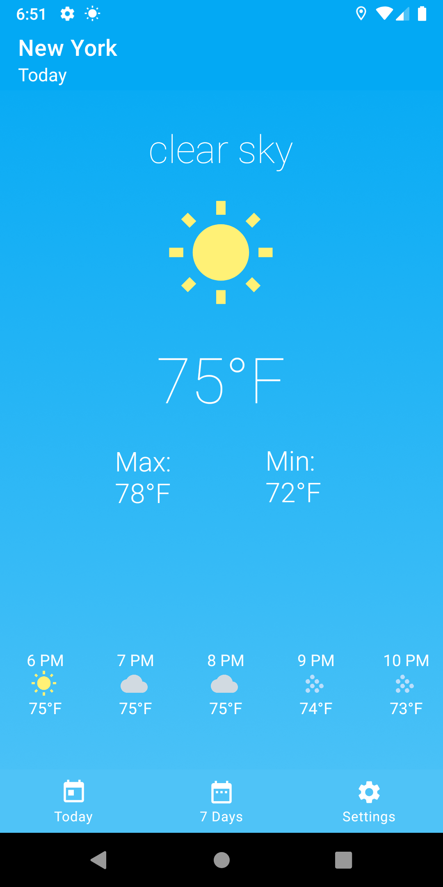
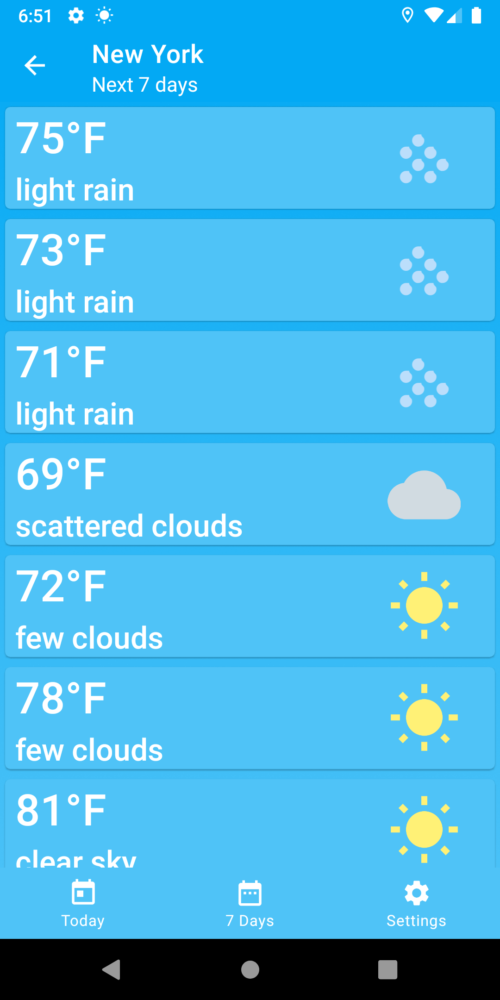
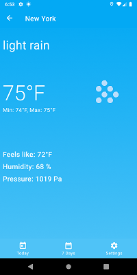
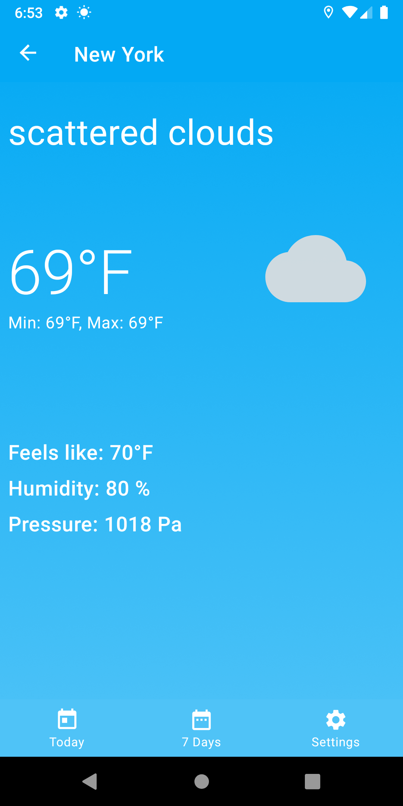
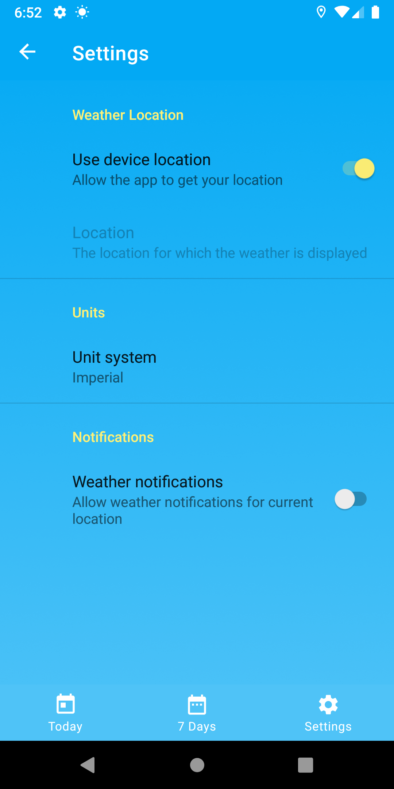
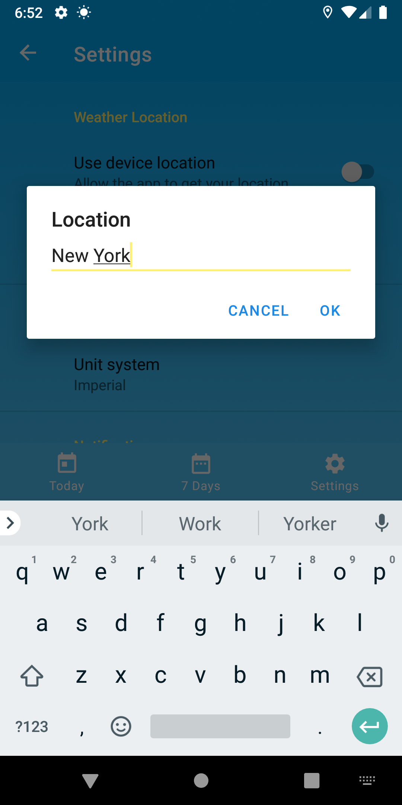
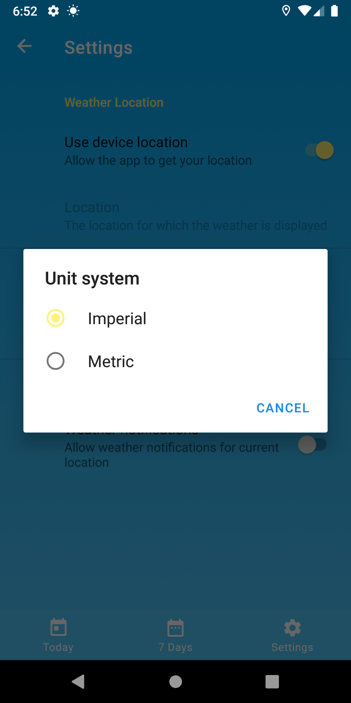
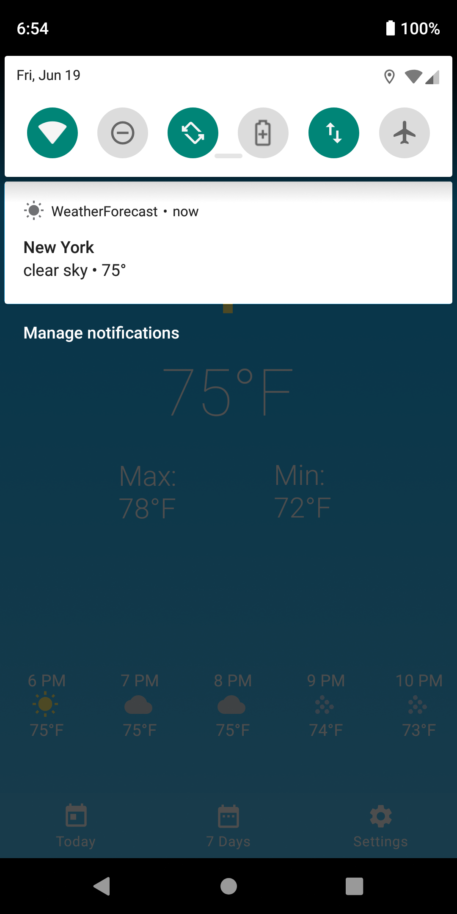

# WeatherForecast
Weather - local weather forecast, weather daily and hourly
  
Overview: 
Presents current and hourly weather for device location or any other location specified by the user. 
Future weather available for up to seven days along with weather details for each day of the week. 
Optional persistent notifications provided for current location. 
 
Used: 
• MVVM design pattern. 
• Room persistance library. 
• Retrofit for interacting with RestAPIs. 
• Coroutines for asynchronous programming and threading. 
• Navigation components, BottomNav, DrawerLayout with SaveArgs interaction. 
• Location Services. 
• Connectivity interceptor for checking network availability. 
• Kodein dependency injection library. 
 
 
Screens:
 

